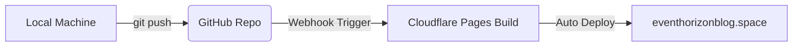

# 🌌 Event & Horizon
> **Science Journalism from the Edge of the Observable Universe**

[](https://eventhorizonblog.space)
[](https://github.com/ShivankXD/EventHorizon)
[](https://eventhorizonblog.space)

**Event & Horizon** is an independent, rigorous, and beautifully crafted space science journalism digital publication. Inspired by high-end classical editorial design (like *The New York Times* and *The Atlantic*) and modernized with fluid layout dynamics, responsive typography, and interactive cosmic tracking modules.

✨ **Live Publication:** [eventhorizonblog.space](https://eventhorizonblog.space)

---

## 📸 Editorial Showcase

*Below is the front page layout featuring our custom typography scale, layout grids, and interactive widgets. Replace these placeholder paths with your actual screenshots.*

<!-- Front page hero and sidebar layout -->


<p align="center">
  
  
</p>

> 💡 **Tip for Custom Screenshots:** The images above are stunning space photography placeholders. To display your own website screenshots here, just drop your files (named `screenshot_hero.png`, `screenshot_dark.png`, etc.) in the root folder of this project, change the image paths to point to your files (e.g., `./screenshot_hero.png`), and commit them!


---

## 🎨 The Design System & Aesthetics
The website is built on a custom design system centered around readability, classic typesetting, and editorial flow:

* **Typographic Palette:**
  * **Headings:** `Fraunces` (Georgia, serif) – Dynamic serif font giving a premium, authoritative, and intellectual header aesthetic.
  * **Body Text:** `Lora` (Georgia, serif) – Optimized for long-form immersive readability.
  * **System / Data Elements:** `Fira Code` (monospace) – Used for widgets, timestamps, and metadata.
* **Color Schemes:**
  * 📜 **Classic Edition (Light Mode):** A warm, high-contrast palette featuring a soft paper background (`#f6f3ee`), rich carbon ink (`#18160f`), and vermilion red accent (`#b52b18`).
  * 🌌 **Cosmic Edition (Dark Mode):** A deep observatory-style palette featuring dark carbon paper (`#111010`) and warm starlight text (`#e8e4dc`).

---

## 🚀 Core Features

### 📰 Front Page Grid
A fully responsive multi-column editorial grid that displays top headlines, sub-features, and categorized articles. Integrated filter buttons allow readers to filter content across **Exo Worlds**, **Black Holes**, **Missions**, **Cosmology**, **Supernovae**, and **Technology**.

### ⏳ 'On This Day' in Space History
A curated daily historical banner that displays crucial milestones from humanity's journey into space (e.g., the launch of Apollo 13, Voyager milestones, Hubble breakthroughs).

### 🚀 Space Launch Tracker
A live-updating widget listing upcoming orbital spaceflights, featuring countdown timers, rocket types, and mission descriptions.

### 📅 Space Calendar
A curated, interactive schedule of major astronomical events, including meteor showers, eclipses, planetary oppositions, and celestial conjunctions.

### 🔖 Personal Archive (Reading List)
An offline-first bookmarking engine utilizing browser `localStorage`. Readers can save articles for later reading with zero server database requirements.

### 🌓 Ambient Lighting Control
A system-level dark/light mode toggle with state persistence across page loads, matching your reading preference dynamically.

### 🔔 Toast Notification Engine
A lightweight, modern CSS/JS notification engine to deliver unobtrusive status alerts (e.g., "Article Bookmarked", "Welcome to Event & Horizon").

---

## 🛠️ Technology Stack
* **Markup:** Semantic HTML5 to ensure optimal structure, accessibility, and high SEO performance.
* **Styles:** Custom vanilla CSS3 featuring:
  * CSS Variables for color scheme states.
  * Dynamic fluid scaling (`clamp()`) for typographic hierarchies.
  * Flexbox & CSS Grid for editorial structure.
  * Zero heavy frameworks (Tailwind/Bootstrap) to guarantee extremely fast load times.
* **Logic:** Vanilla ES6 Javascript utilizing modern web APIs:
  * `localStorage` for personal reading list storage and theme persistence.
  * `DocumentFragment` updates to optimize reflow and rendering performance.

---

## 🏗️ Architecture & Deployment
Continuous deployment is fully integrated into the repository:



* **Hosting Platform:** [Cloudflare Pages](https://pages.cloudflare.com/) – Offers rapid edge network distribution, free automatic SSL certificates, global CDN, and automated HTTP/3 support.
* **Domain Configuration:** Managed via Cloudflare DNS, offering full routing, CNAME flattening, and instant redirection from the apex domain to `www` records.

---

## 📦 Running Locally
To run and modify the publication locally:

1. Clone the repository:
   ```bash
   git clone https://github.com/ShivankXD/EventHorizon.git
   ```
2. Navigate into the directory:
   ```bash
   cd EventHorizon
   ```
3. Spin up any local server (e.g., using Python, Node, or VS Code Live Server):
   ```bash
   # Python 3
   python -m http.server 8000
   
   # Node.js (npx)
   npx serve .
   ```
4. Open `http://localhost:8000` in your web browser.

---
*Developed with 🖤 for space exploration and independent science journalism.*